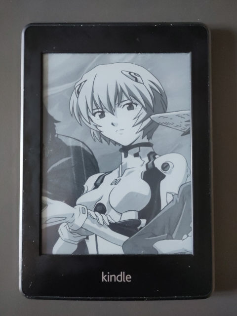

# Mastodon image fetcher for kindle-dash

This is really only a script that fetches the last non-CW image from Mastodon, fits to your screen dimensions and writes it to a PNG file.
This is meant to be used with [kidle-dash](https://github.com/pascalw/kindle-dash), but you can use it in other linux-based ebook readers or in any case you may need the last post image saved to a file.

## Install (with kindle-dash)

You will need a jailbroken kindle.

Follow the [kidle-dash](https://github.com/pascalw/kindle-dash) instructions to install the dashboard. From now on, let's say you installed it in a folder called `my-dashboard`.

(Install Python3)[https://wiki.mobileread.com/wiki/Python_on_Kindle] on your kindle
Check python is correctly installed running `python3 --version` (should print something like `Python 3.9.8`).

> Note: Python version 3.x is required. This will not work with Python 2.x

Copy `fetch-dashboard.sh.example` in `my-dashboard/local/fetch-dashboard.sh` (you will overwrite an already present file).

Open `mastodon-image-fetcher.py` and set your Kindle's screen resolution in the Config section (if you don't know it, you can find it running `eips -i` on the kindle terminal).

Copy `mastodon-image-fetcher.py` in `my-dashboard/local/mastodon-image-fetcher.py`

Start the dashboard as explained in kindle-dash documentation (running `my-dashboard/start.sh`)

### Troubleshooting

Kindle-dash saves a logfile in `my-dashboard/logs/dash.log`.

## Install (generic)
Just open `mastodon-image-fetcher.py` and set the preferred screen resolution in the Config section.

## Optimizations

The image is converted in BW and saved in PNG format, because some ancient utilities for e-ink screens (like the Kindle's `eips` commad) do not support fancier formats, like progressive JPEG (one of the most common image format on the modern Internet).
